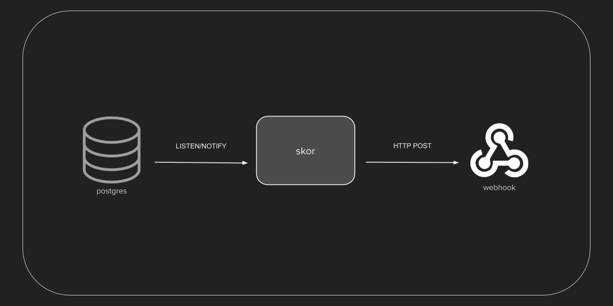

# Skor

`skor` is a utility for PostgreSQL which calls a webhook with row changes as JSON whenever an INSERT, UPDATE or DELETE event occurs on a particular table. It comprises of a PostgreSQL trigger function and the C program `skor` that listens to database notifications and invokes the webhook with a JSON payload.

## When to use
- When you want to trigger an action in an external application when a table row is modified.
- When you want a lightweight notification system for changes in the database.
- When you want to send the changes to a message queue such as AMQP, Kafka etc.

## How it works
A PostgreSQL stored procedure is set up as a trigger on the required table(s). This trigger uses PostgreSQL's LISTEN and NOTIFY to publish change events as JSON to a notification channel. `Skor` watches this channel for messages and when a message is received, it makes an HTTP POST call to the webhook with the JSON payload. The webhook can then decide to take an action on this.




## Caveats
- Events are delivered only once by Postgres. So if `skor` fails for some reason, the events will not be redelivered.

## Usage

### Set up the trigger:

Use the `init.sh` script to create the trigger and add it to the tables for which you want to get change events.

```bash
$ ./init.sh table1 table2 | psql -h localhost -p 5432 -U postgres -d postgres --
```

### Run Skor:
A pre-built Docker image with the `skor` binary is available at `sidmutha/hasura-skor`.

Run it as:

```bash
$ docker run \
    -e DBNAME="postgres" \
    -e PGUSER="postgres" \
    -e PGPASS="''" \
    -e PGHOST="localhost" \
    -e PGPORT=5432 \
    -e WEBHOOKURL="http://localhost:5000/"
    --net host \
    -it sidmutha/hasura-skor:v0.1.1
```

Make sure you use the appropriate database parameters and webhook URL above.

## Examples

### INSERT

Query:
```sql
INSERT INTO test_table(name) VALUES ('abc1');
```

JSON webhook payload:

```json
{"data": {"id": 1, "name": "abc1"}, "table": "test_table", "op": "INSERT"}
```

### UPDATE

Query:
```sql
UPDATE test_table SET name = 'pqr1' WHERE id = 1;
```

JSON webhook payload:

```json
{"data": {"id": 1, "name": "pqr1"}, "table": "test_table", "op": "UPDATE"}
```

### DELETE

Query:
```sql
DELETE FROM test_table WHERE id = 1;
```

JSON webhook payload:

```json
{"data": {"id": 1, "name": "pqr1"}, "table": "test_table", "op": "DELETE"}
```

## Deploying Skor on Hasura

The pre-built Docker image with the `skor` binary is available at `sidmutha/hasura-skor` and can be deployed as a microservice with the sample `k8s.yaml` in this repo.
The webhook can be another microservice that exposes an endpoint.

To learn more on deploying microservices on Hasura you may check out the [documentation](https://docs.hasura.io/0.15/manual/microservices/index.html).


## Build Skor:

Run:

```bash
$ make
```


## Test

The test runs `skor` and a python-flask server for the webhook. Make sure you have installed python-flask before running the test.

Run the test (present in the root directory) as:

```bash
$ python test.py
```

## Contributing
Contributions are welcome! 

Please look at the [issues](https://github.com/hasura/skor/issues) page and help us in improving `skor`!